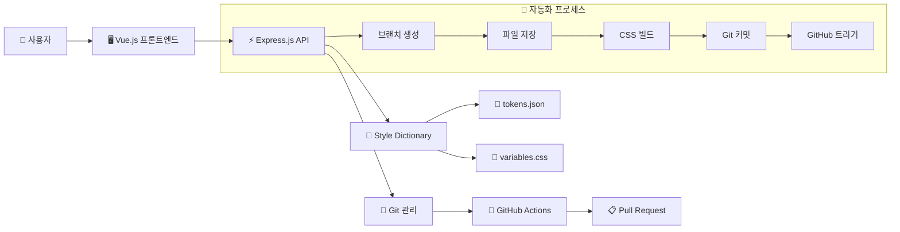
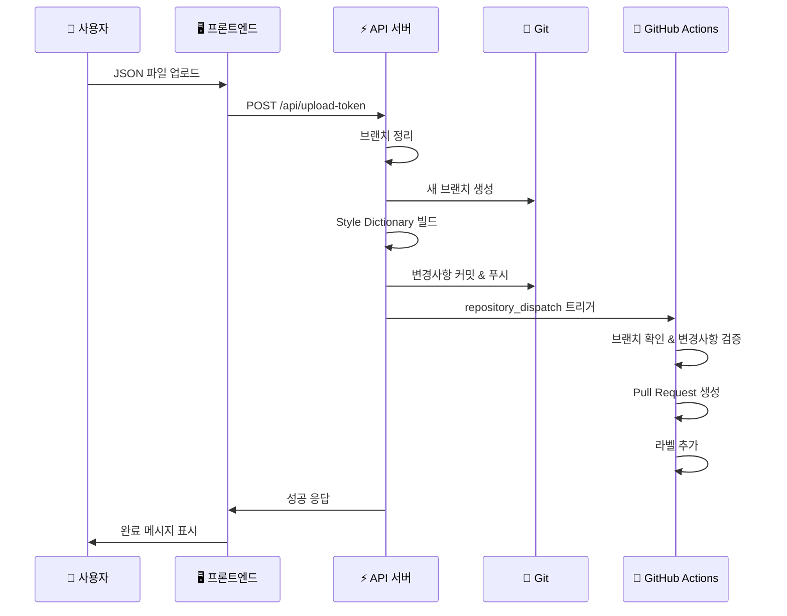

# 🎨 Design Token Sync

> **자동화된 디자인 토큰 동기화 시스템**  
> Figma에서 추출한 디자인 토큰을 웹 인터페이스로 업로드하고, 자동으로 CSS 변수로 변환하여 GitHub Pull Request를 생성하는 통합 솔루션

[](https://opensource.org/licenses/MIT)
[](https://nodejs.org/)
[](https://vuejs.org/)
[](https://expressjs.com/)

## 📋 목차

- [✨ 주요 기능](#-주요-기능)
- [🏗️ 아키텍처](#️-아키텍처)
- [🚀 빠른 시작](#-빠른-시작)
- [📁 프로젝트 구조](#-프로젝트-구조)
- [⚙️ 설정 가이드](#️-설정-가이드)
- [🔄 워크플로우](#-워크플로우)
- [🎯 사용법](#-사용법)
- [🛠️ 기술 스택](#️-기술-스택)
- [📊 디자인 토큰 구조](#-디자인-토큰-구조)
- [🔧 고급 설정](#-고급-설정)
- [🐛 문제 해결](#-문제-해결)

## ✨ 주요 기능

### 🔄 완전 자동화된 워크플로우
- **웹 인터페이스**를 통한 직관적인 토큰 업로드
- **자동 브랜치 생성** 및 관리
- **실시간 변경사항 감지** 및 검증
- **GitHub Pull Request 자동 생성**
- **라벨 및 상세 설명** 자동 추가

### 🎨 포괄적인 디자인 토큰 지원
- **색상 시스템**: Primary, Secondary, 상태 색상, 전체 컬러 팔레트
- **타이포그래피**: 헤딩, 본문, 폰트 무게별 스타일
- **간격 시스템**: 12단계 간격 (4rem ~ 48rem)
- **반지름**: 기본부터 알약형까지 다양한 형태
- **그리드**: Bootstrap 호환 그리드 시스템
- **이펙트**: 그림자 효과 (Small, Regular, Large)

### 🛡️ 안정성 및 신뢰성
- **동시 요청 방지** 메커니즘
- **오류 처리 및 롤백** 기능
- **변경사항 검증** 시스템
- **오래된 브랜치 자동 정리**

### 🚀 개발자 친화적
- **Style Dictionary** 기반 확장 가능한 구조
- **GitHub Actions** 통합
- **실시간 피드백** 시스템
- **상세한 로깅** 및 디버깅 정보

## 🏗️ 아키텍처



## 🚀 빠른 시작

### 1️⃣ 저장소 클론

```bash
git clone https://github.com/your-username/design-token-sync.git
cd design-token-sync
```

### 2️⃣ 환경 설정

```bash
# 환경 변수 설정
cp env.example .env

# .env 파일 편집
GITHUB_OWNER=your-github-username
GITHUB_REPO=design-token-sync
GITHUB_TOKEN=your-github-personal-access-token
PORT=3000
```

### 3️⃣ 의존성 설치

```bash
# 백엔드 의존성 설치
npm install

# 프론트엔드 의존성 설치
cd frontend
npm install
cd ..
```

### 4️⃣ 개발 서버 실행

```bash
# 터미널 1: 백엔드 서버
npm start

# 터미널 2: 프론트엔드 서버
cd frontend
npm run dev
```

### 5️⃣ 브라우저에서 확인

- **프론트엔드**: `http://localhost:5173`
- **백엔드 API**: `http://localhost:3000`
- **API 상태**: `http://localhost:3000/api/status`

## 📁 프로젝트 구조

```
design-token-sync/
├── 📁 .github/
│   └── workflows/
│       └── update-design-tokens.yml    # GitHub Actions 워크플로우
├── 📁 frontend/                        # Vue.js 프론트엔드
│   ├── src/
│   │   ├── components/
│   │   │   └── InputToken.vue          # 토큰 업로드 컴포넌트
│   │   ├── App.vue                     # 메인 앱 컴포넌트
│   │   └── main.js                     # 앱 진입점
│   ├── package.json                    # 프론트엔드 의존성
│   └── vite.config.js                  # Vite 설정
├── 📁 style-dictionary/                # Style Dictionary 설정
│   ├── config.json                     # 빌드 설정
│   └── tokens.json                     # 디자인 토큰 소스
├── 📁 styles/                          # 생성된 CSS 파일
│   └── variables.css                   # CSS 변수 출력
├── 📁 build/                           # 빌드 출력 디렉토리
├── 📁 tokens/                          # 임시 토큰 저장소
├── 📄 index.js                         # Express API 서버
├── 📄 package.json                     # 백엔드 의존성
├── 📄 env.example                      # 환경 변수 예시
└── 📄 README.md                        # 프로젝트 문서
```

## ⚙️ 설정 가이드

### 🔑 GitHub Token 생성

1. **GitHub Settings** → **Developer settings** → **Personal access tokens**
2. **Generate new token** 선택
3. **필수 권한 선택**:
   - ✅ `repo` (전체 저장소 접근)
   - ✅ `workflow` (GitHub Actions 트리거)
4. 생성된 토큰을 `.env` 파일에 추가

### 🏷️ GitHub 라벨 설정

프로젝트가 자동으로 다음 라벨들을 생성합니다:

- 🎨 **design-tokens**: 디자인 토큰 관련 변경사항
- 🤖 **auto-generated**: 자동으로 생성된 PR

### 📝 Style Dictionary 설정

`style-dictionary/config.json`에서 출력 형식을 커스터마이징할 수 있습니다:

```json
{
  "source": ["style-dictionary/tokens.json"],
  "platforms": {
    "css": {
      "transformGroup": "css",
      "buildPath": "styles/",
      "files": [{
        "destination": "variables.css",
        "format": "css/variables"
      }]
    }
  }
}
```

## 🔄 워크플로우

### 1️⃣ 사용자 작업 흐름



### 2️⃣ 자동화 단계

1. **🧹 브랜치 정리**: 오래된 `token-update-*` 브랜치 삭제
2. **🔄 메인 브랜치 동기화**: 최신 상태로 업데이트
3. **🌿 새 브랜치 생성**: `token-update-{timestamp}-{random}` 형식
4. **💾 토큰 파일 저장**: JSON 데이터를 `style-dictionary/tokens.json`에 저장
5. **🎨 CSS 빌드**: Style Dictionary로 CSS 변수 생성
6. **📋 변경사항 확인**: 실제 변경사항이 있는지 검증
7. **🔄 Git 작업**: 변경사항 커밋 및 원격 저장소에 푸시
8. **🚀 GitHub Actions 트리거**: `repository_dispatch` 이벤트 발생
9. **📋 PR 생성**: GitHub API를 통한 자동 Pull Request 생성
10. **🏷️ 라벨 추가**: 자동 라벨링 및 상세 설명 추가

## 🎯 사용법

### 📤 토큰 업로드

1. **Figma에서 토큰 추출**:
   - Figma 플러그인을 사용하여 디자인 토큰을 JSON 형태로 추출
   - 또는 기존 토큰 JSON 파일 준비

2. **웹 인터페이스에서 업로드**:
   - `http://localhost:5173` 접속
   - **파일 선택** 버튼 클릭
   - JSON 파일 선택 후 **전송하기** 클릭

3. **자동 처리 확인**:
   - 성공 메시지 확인
   - GitHub 저장소에서 생성된 PR 확인

### 📊 상태 확인

```bash
# API 서버 상태 확인
curl http://localhost:3000/api/status

# 응답 예시
{
  "status": "running",
  "timestamp": "2025-07-16T08:00:00.000Z",
  "environment": {
    "GITHUB_OWNER": "설정됨",
    "GITHUB_REPO": "설정됨",
    "GITHUB_TOKEN": "설정됨"
  }
}
```

### 🔍 생성된 CSS 변수 확인

업로드 후 `styles/variables.css`에서 생성된 CSS 변수를 확인할 수 있습니다:

```css
:root {
  /* 색상 변수 */
  --color-primary-color: #7749f8;
  --color-primary-color-dark: #5227cc;
  --color-primary-light: #ebe5fc;
  
  /* 타이포그래피 변수 */
  --typography-bold-h1-heading-font-size: 40rem;
  --typography-bold-h1-heading-font-family: Inter;
  --typography-bold-h1-heading-font-weight: 700;
  
  /* 간격 변수 */
  --collection-1-space-spacing-1: 4rem;
  --collection-1-space-spacing-2: 8rem;
  
  /* 반지름 변수 */
  --collection-1-radius-radius-default: 6rem;
  --collection-1-radius-radius-pill: 800rem;
}
```

## 🛠️ 기술 스택

### 🖥️ 프론트엔드
- **Vue.js 3**: Composition API 기반 반응형 UI
- **Vite**: 빠른 개발 서버 및 빌드 도구
- **Native JavaScript**: 의존성 최소화

### ⚡ 백엔드
- **Node.js**: JavaScript 런타임
- **Express.js**: 웹 프레임워크
- **Multer**: 파일 업로드 처리
- **Simple Git**: Git 작업 자동화
- **Node Fetch**: HTTP 요청 처리

### 🎨 디자인 토큰 처리
- **Style Dictionary**: 토큰 변환 및 빌드
- **JSON**: 토큰 데이터 형식
- **CSS Variables**: 출력 형식

### 🚀 자동화 및 배포
- **GitHub Actions**: CI/CD 파이프라인
- **GitHub API**: PR 생성 및 관리
- **Repository Dispatch**: 워크플로우 트리거

## 📊 디자인 토큰 구조

### 🎨 색상 토큰
```json
{
  "color": {
    "primary": {
      "color": { "value": "#7749f8" },
      "color dark": { "value": "#5227cc" },
      "light": { "value": "#ebe5fc" }
    },
    "status": {
      "success": { "value": "#28a745" },
      "danger": { "value": "#dc3545" },
      "warning": { "value": "#ffc107" },
      "info": { "value": "#17a2b8" }
    }
  }
}
```

### 📝 타이포그래피 토큰
```json
{
  "typography": {
    "bold": {
      "h1 heading": {
        "fontSize": { "value": 40 },
        "fontFamily": { "value": "Inter" },
        "fontWeight": { "value": 700 },
        "lineHeight": { "value": 48 }
      }
    }
  }
}
```

### 📏 간격 토큰
```json
{
  "Collection 1": {
    "space": {
      "spacing-1": { "value": 4 },
      "spacing-2": { "value": 8 },
      "spacing-3": { "value": 12 }
    }
  }
}
```

## 🔧 고급 설정

### 🎯 Style Dictionary 확장

다른 플랫폼용 출력 형식을 추가할 수 있습니다:

```json
{
  "platforms": {
    "css": {
      "transformGroup": "css",
      "buildPath": "styles/",
      "files": [{"destination": "variables.css", "format": "css/variables"}]
    },
    "scss": {
      "transformGroup": "scss",
      "buildPath": "styles/",
      "files": [{"destination": "_variables.scss", "format": "scss/variables"}]
    },
    "javascript": {
      "transformGroup": "js",
      "buildPath": "styles/",
      "files": [{"destination": "tokens.js", "format": "javascript/es6"}]
    }
  }
}
```

### 🔄 GitHub Actions 커스터마이징

워크플로우를 수정하여 추가 기능을 구현할 수 있습니다:

```yaml
# 추가 테스트 단계
- name: Run CSS validation
  run: |
    npx stylelint styles/variables.css

# 다른 브랜치로 배포
- name: Deploy to staging
  if: github.ref == 'refs/heads/develop'
  run: |
    # 스테이징 환경 배포 스크립트
```

### 🎨 커스텀 토큰 변환

Style Dictionary 커스텀 변환을 추가할 수 있습니다:

```javascript
// build-tokens.js
const StyleDictionary = require('style-dictionary');

StyleDictionary.registerTransform({
  name: 'size/rem',
  type: 'value',
  matcher: (token) => token.attributes.category === 'size',
  transformer: (token) => `${token.value}rem`
});

StyleDictionary.buildAllPlatforms();
```

## 🐛 문제 해결

### ❌ 일반적인 문제들

#### 1. GitHub Token 오류
```bash
Error: Bad credentials
```
**해결방법**: 
- GitHub Token이 올바른지 확인
- Token에 `repo` 권한이 있는지 확인
- Token이 만료되지 않았는지 확인

#### 2. 포트 충돌
```bash
Error: Port 3000 already in use
```
**해결방법**:
```bash
# 포트 사용 중인 프로세스 확인
lsof -i :3000

# 프로세스 종료
kill -9 <PID>

# 또는 다른 포트 사용
PORT=3001 npm start
```

#### 3. 프론트엔드 빌드 오류
```bash
TypeError: crypto.hash is not a function
```
**해결방법**:
```bash
cd frontend
rm -rf node_modules package-lock.json
npm install
```

#### 4. Style Dictionary 빌드 실패
```bash
Error: Build failed
```
**해결방법**:
- `style-dictionary/tokens.json` 파일이 올바른 JSON 형식인지 확인
- Style Dictionary 설정이 올바른지 확인

### 🔍 디버깅 방법

#### 1. 백엔드 로그 확인
```bash
# 개발 모드로 실행하여 상세 로그 확인
DEBUG=* npm start
```

#### 2. GitHub Actions 로그 확인
- GitHub 저장소의 **Actions** 탭에서 워크플로우 실행 결과 확인
- 각 단계별 로그를 통해 문제 지점 파악

#### 3. API 상태 확인
```bash
curl http://localhost:3000/api/status
```

### 📞 지원 및 기여

#### 🐛 버그 리포트
- GitHub Issues를 통해 버그 리포트 제출
- 재현 가능한 예시와 함께 상세한 설명 제공

#### 💡 기능 제안
- 새로운 기능 아이디어나 개선 사항 제안
- 사용 사례와 함께 구체적인 요구사항 설명

#### 🤝 기여 방법
1. 저장소 Fork
2. 새로운 브랜치 생성 (`git checkout -b feature/amazing-feature`)
3. 변경사항 커밋 (`git commit -m 'Add amazing feature'`)
4. 브랜치에 푸시 (`git push origin feature/amazing-feature`)
5. Pull Request 생성

---

## 📄 라이센스

이 프로젝트는 MIT 라이센스 하에 배포됩니다. 자세한 내용은 `LICENSE` 파일을 참조하세요.

## 🙏 감사 인사

- [Style Dictionary](https://amzn.github.io/style-dictionary/) - 디자인 토큰 변환 도구
- [Vue.js](https://vuejs.org/) - 반응형 웹 프레임워크
- [Express.js](https://expressjs.com/) - 웹 애플리케이션 프레임워크
- [GitHub Actions](https://github.com/features/actions) - CI/CD 플랫폼

---

<div align="center">
  <strong>🎨 Design Token Sync로 디자인 시스템 관리를 자동화하세요!</strong>
</div>